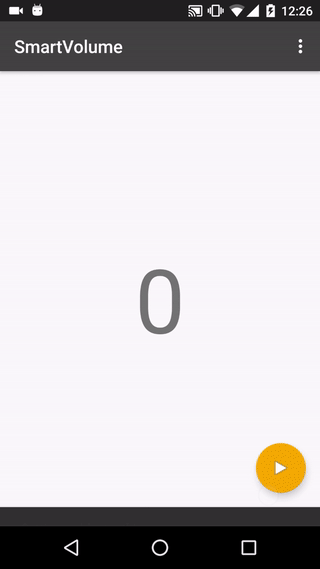
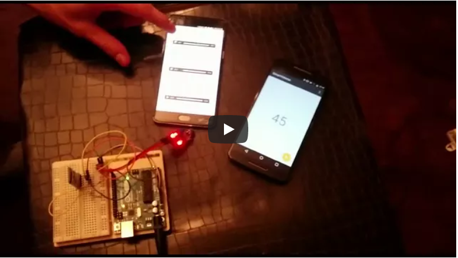
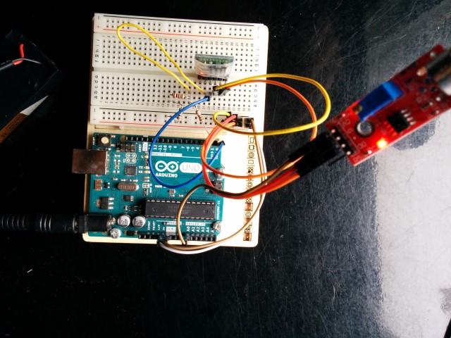
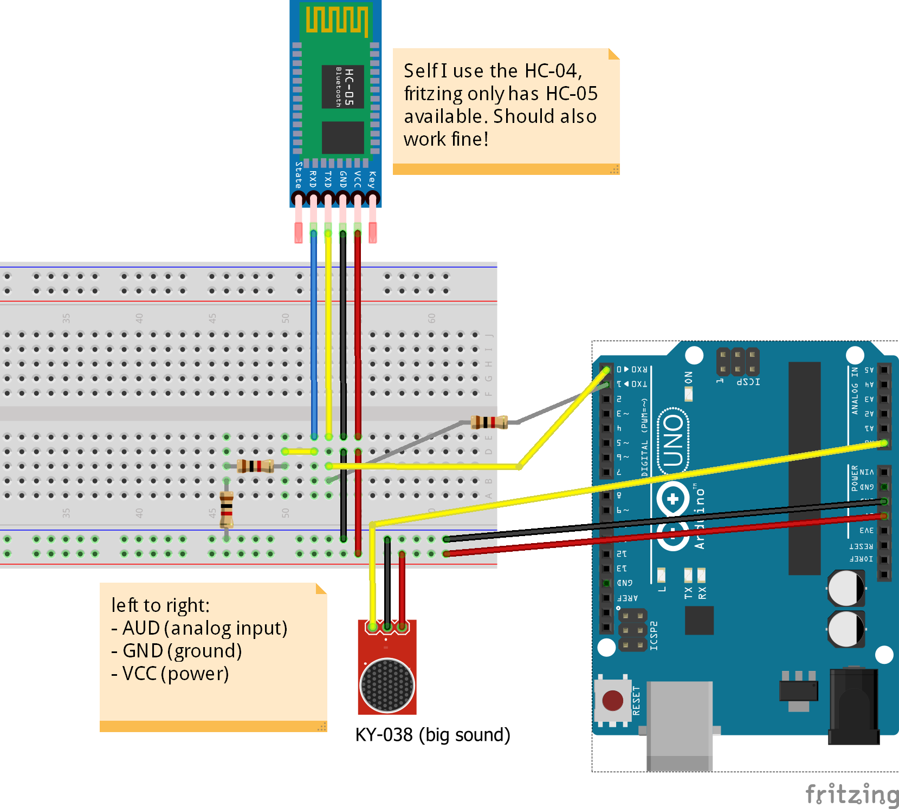

# SmartVolume
Android application that notifies the user when noise levels are too high.
Communicates with Arduino through bluetooth to get information from noise sensor.

If you are interested about the process of creating this project, then
you can find a detailed explanation on my site:
[Android bluetooth connection with arduino](https://melledijkstra.com/guides/android-bluetooth-connection-with-arduino)

## DEMO & Impressions

### Android

### Arduino

The Arduino code can be found here:
[https://github.com/MelleDijkstra/ArduinoProjects/tree/master/bluetooth-soundsensor](https://github.com/MelleDijkstra/ArduinoProjects/tree/master/bluetooth-soundsensor)

